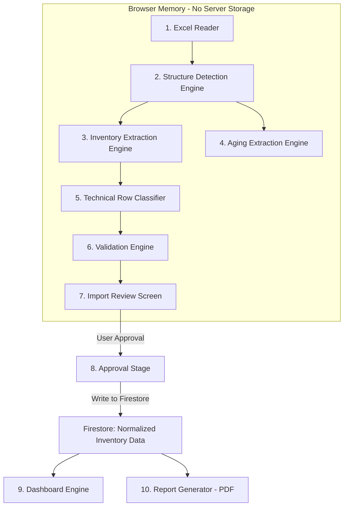

# Inventory Intelligence Architecture Blueprint

> **Version:** 1.0 · **Date:** 2026-07-07 · **Status:** Pre-Implementation Review
>
> This document defines the full ingestion-to-report pipeline architecture for the Inventory Analytics & Reporting Portal. No code should be written for new features until this blueprint is reviewed and approved.

---

## 1. Full Pipeline Diagram



**Key principle:** Stages 1–7 execute entirely in browser memory. No inventory row data touches Firestore until the user explicitly approves at Stage 8.

---

## 2. Responsibility of Each Engine

### Stage 1: Excel Reader
| Aspect | Specification |
|---|---|
| **Input** | `.xlsx` files selected via file picker or drag-drop |
| **Output** | Raw workbook object per file (SheetJS `WorkBook`) |
| **Responsibility** | Read binary file data using `FileReader` API, decode with SheetJS |
| **Must NOT do** | Validate business data, detect columns, classify rows |
| **Multi-file** | Process each file independently, return array of workbook objects |

### Stage 2: Structure Detection Engine
| Aspect | Specification |
|---|---|
| **Input** | Raw workbook object |
| **Output** | `SheetStructure[]` — one per sheet with header row index, column map, sheet classification |
| **Responsibility** | (a) Enumerate all sheets, (b) find header row by alias matching, (c) map each column to a standard field or classify as aging/ignored, (d) classify sheet as `inventory_sheet`, `summary_sheet`, or `unknown_sheet` |
| **Sheet classification rule** | A sheet is an inventory sheet if >= 2 standard column aliases match AND the sheet name does not contain "summary". A sheet with >= 3 matches overrides the summary-name heuristic. |
| **Must NOT do** | Extract row data, validate values, reject rows |

### Stage 3: Inventory Extraction Engine
| Aspect | Specification |
|---|---|
| **Input** | Raw rows + `SheetStructure` (column map) |
| **Output** | `ExtractedInventoryRow[]` — every row that could plausibly be an inventory item |
| **Responsibility** | Map raw cell values to standard fields using the column map. Extract ALL rows that have at least one populated identifier field (item code OR description). |
| **Critical rule** | **Never reject a row that could be a real inventory item.** If item code is present but description is missing, still extract it. If description is present but item code is missing, still extract it. Missing fields are flagged — not discarded. |
| **Must NOT do** | Validate quantities, check for duplicates, compute variation |

### Stage 4: Aging Extraction Engine
| Aspect | Specification |
|---|---|
| **Input** | Raw rows + `SheetStructure` (aging column indices) |
| **Output** | `AgingBucketData[]` — one record per item per aging bucket |
| **Responsibility** | Extract aging bucket values for each row, keyed by item code + sheet |
| **Aging buckets** | `1-30d`, `31-60d`, `61-90d`, `91-180d`, `181-365d`, `1yr`, `2yr`, `3yr`, `4yr`, `5-7yr`, `7yr+` |
| **Storage** | Separate from main inventory dataset. Linked by item code. |
| **Must NOT do** | Include aging data in the main parsed inventory row object |

### Stage 5: Technical Row Classifier
| Aspect | Specification |
|---|---|
| **Input** | All raw rows from inventory sheets |
| **Output** | Classification label per row |
| **Categories** | See Section 4 below |
| **Responsibility** | Identify and label non-inventory rows so they can be separated in the UI |
| **Critical rule** | Classification is additive labeling, not deletion. Every row gets a label. |

### Stage 6: Validation Engine
| Aspect | Specification |
|---|---|
| **Input** | `ExtractedInventoryRow[]` (only rows classified as `inventory_item`) |
| **Output** | `ValidationIssue[]` — zero or more issues per row |
| **Responsibility** | Check each extracted row for data quality issues |
| **Critical rule** | Validation flags issues for review. It does NOT delete or reject rows. A row with 3 validation issues is still an extracted inventory row — it just has 3 flags attached. |

### Stage 7: Import Review Screen
| Aspect | Specification |
|---|---|
| **Input** | All classified rows + validation issues |
| **Output** | User decision (approve / go back to re-upload) |
| **Terminology** | "Imported Rows", "Ignored Technical Rows", "Needs Review Rows" |
| **Accountability formula** | `Total Worksheet Rows = Imported + Ignored Technical + Needs Review` |

### Stage 8: Approval Stage
| Aspect | Specification |
|---|---|
| **Input** | User clicks "Approve and Save" |
| **Output** | Firestore documents created |
| **Responsibility** | Batch-write all approved inventory rows to Firestore. Save aging data separately. Update report status to "Validated". |
| **Critical rule** | This is the ONLY point where parsed data enters Firestore. |

### Stage 9: Dashboard Engine (Future)
- Uses only Firestore-persisted approved data, never browser-memory state.

### Stage 10: Report Generator (Future)
- **Sections:** Executive summary, inventory overview, org analysis, supplier analysis, accuracy metrics, variance analysis, top critical items, observations, photos, location, worker evidence, recommendations, appendix.

---

## 3. Data Models / Interfaces Needed

### New Interfaces Required

```typescript
// Sheet-level structure output from Stage 2
interface SheetStructure {
  sheetName: string;
  sheetType: "inventory_sheet" | "summary_sheet" | "unknown_sheet";
  headerRowIndex: number;
  totalRawRows: number;
  columnMap: ColumnMapping[];
  agingColumnIndices: number[];
}

interface ColumnMapping {
  columnIndex: number;
  sourceColumnName: string;
  mappedField: string | null;      // null = unrecognized
  mappingType: "standard" | "aging" | "ignored";
  confidence: "exact" | "alias" | "fuzzy";
}

// Aging data model (Stage 4)
interface AgingBucketRecord {
  itemCode: string;
  sourceFileName: string;
  sheetName: string;
  originalRowNumber: number;
  buckets: Partial<Record<AgingBucketKey, number>>;
}

type AgingBucketKey =
  | "1_30d" | "31_60d" | "61_90d" | "91_180d" | "181_365d"
  | "1yr" | "2yr" | "3yr" | "4yr" | "5_7yr" | "7yr_plus";

// Validation issue (Stage 6)
interface ValidationIssue {
  field: string;
  severity: "error" | "warning" | "info";
  code: ValidationCode;
  message: string;
}

type ValidationCode =
  | "MISSING_ITEM_CODE"
  | "MISSING_DESCRIPTION"
  | "MISSING_SUPPLIER"
  | "MISSING_ORG"
  | "INVALID_QUANTITY"
  | "INVALID_VALUE"
  | "DUPLICATE_ITEM"
  | "UNEXPECTED_BLANK"
  | "MISSING_BOTH_QUANTITIES";

// Enhanced extracted row (replaces ParsedInventoryRow for Stage 3)
interface ExtractedInventoryRow {
  reportId: string;
  sourceFileName: string;
  sheetName: string;
  originalRowNumber: number;
  rawRowData: Record<string, unknown>;
  // Mapped fields — all optional at extraction time
  item?: string;
  description?: string;
  org?: string;
  rawSupplier?: string;
  totalValueSar?: number;
  systemOnHand?: number;
  physicalCount?: number;
  variation?: number;
  remarks?: string;
  reported?: string;
  // Post-validation attachments
  validationIssues: ValidationIssue[];
  // Post-supplier-detection
  resolvedSupplier?: string;
  supplierDetectionMethod?: string;
}

// Row classification output (Stage 5)
interface ClassifiedRow {
  sourceFileName: string;
  sheetName: string;
  originalRowNumber: number;
  rawRowData: Record<string, unknown>;
  classification: RowClassification;
  reason: string;
}

type RowClassification =
  | "inventory_item"
  | "ignored_header_row"
  | "ignored_empty_row"
  | "ignored_total_row"
  | "ignored_subtotal_row"
  | "ignored_signature_row"
  | "ignored_metadata_row"
  | "ignored_summary_sheet_row";
```

---

## 4. Row Classification Rules

### Decision Tree

```
FOR each row in an inventory sheet:
|
+-- Row index <= headerRowIndex?
|     YES -> ignored_header_row
|
+-- All cells empty or whitespace?
|     YES -> ignored_empty_row
|
+-- Item column value matches a known column alias? (repeated header)
|     YES -> ignored_header_row ("Repeated header row")
|
+-- Both item AND description are empty?
|     YES -> ignored_empty_row ("No identifiers")
|
+-- First 5 columns contain "total", "grand total", "subtotal"?
|     YES -> ignored_total_row
|
+-- First 5 columns contain "sum of", "count of", "average"?
|     YES -> ignored_subtotal_row
|
+-- Row has <=4 non-blank cells AND contains signature keywords?
|     YES -> ignored_signature_row
|
+-- Row has <=4 non-blank cells AND contains metadata keywords?
|     YES -> ignored_metadata_row
|
+-- ELSE -> inventory_item (pass to Extraction Engine)
```

### Validation Engine Issue Flags

| Code | Condition | Severity |
|---|---|---|
| `MISSING_ITEM_CODE` | `item` field is empty/null | `warning` |
| `MISSING_DESCRIPTION` | `description` field is empty/null | `warning` |
| `MISSING_SUPPLIER` | No supplier from any detection method | `info` |
| `MISSING_ORG` | `org` field is empty/null | `info` |
| `INVALID_QUANTITY` | System or physical count has non-numeric value | `error` |
| `INVALID_VALUE` | Total value (SAR) is non-numeric | `warning` |
| `DUPLICATE_ITEM` | Same item code appears multiple times | `warning` |
| `UNEXPECTED_BLANK` | >50% of mapped fields are empty | `warning` |
| `MISSING_BOTH_QUANTITIES` | Both system and physical count are null | `error` |

**Critical:** All severity levels produce flags only. No row is deleted.

---

## 5. Column Mapping Rules

### Standard Field Aliases

| Target Field | Known Aliases |
|---|---|
| `item` | Item, Item Code, ITEM_CODE, ITEM, ITEM NO, Material, Material Code |
| `description` | Description, ITEM_DESCRIPTION, Item Description, Material Description |
| `org` | Org, Organization, UNIT, VAL_UNIT_CODE, Division, Sub Division |
| `supplier` | Supplier, Supplier Name, PARTY_NAME, Vendor, Vendor Name |
| `totalValueSar` | Total Value, Value, Total Value (SAR), Inventory Value, Amount, SAR Value |
| `systemOnHand` | System on hand, System Qty, ERP, ERP Qty, CLOSING_QTY, Grand Total, On Hand |
| `physicalCount` | Physical Count, PHYSICAL COUNT, PHY, Counted Qty, Actual Qty |
| `variation` | Variation, Variance, Difference, DIF |
| `remarks` | Remarks, Comments, Remark |
| `reported` | Reported, Reported By, Counted By, Auditor, Name |

### Matching Algorithm
1. Normalize: `toLowerCase().trim().replace(/[^a-z0-9]/g, "")`
2. Match against alias list
3. If no match -> check if aging column
4. If not aging -> classify as `ignored` (unrecognized)

### Supplier Detection Priority
1. Direct value from supplier column (if present and not "Others"/"N/A")
2. Source file name keyword matching
3. Description keyword matching
4. Fallback: "Others"

---

## 6. Aging Data Handling Rules

### Detection Patterns
- `\d+-\d+days` (e.g., "1-30 days")
- `\d+days` (e.g., "30days")
- `\d+yr` or `\d+\+yr` (e.g., "1yr", "7yr+")
- Contains: "days", "yr", "year", "aging", ">", "<"

### Firestore Storage
```
reports/{reportId}/
  inventoryItems/{docId}     <-- main inventory data (no aging)
  agingData/{docId}          <-- aging buckets, keyed by itemCode
```

### Rules
- Aging data is NEVER mixed into main inventory rows
- Aging columns are extracted in parallel by Stage 4
- Each aging record links to its source item via `itemCode`
- Dashboard and Report Generator join aging data at render time

---

## 7. Firestore Save Timing

### Current State (What Happens Today)

| Event | What is saved | When |
|---|---|---|
| File selected | Nothing | -- |
| "Proceed to Validation" clicked | File metadata only (names, sizes) | Immediately |
| Validation page renders | Nothing — data in React context | -- |
| "Approve" clicked | `calculatedSummary` + status change only | Immediately |

### Target State (What Should Happen)

| Event | What is saved | When |
|---|---|---|
| File selected | Nothing | -- |
| "Proceed to Validation" clicked | File metadata only | Immediately |
| Validation page renders | Nothing — data in React context | -- |
| "Approve and Save" clicked | **Batch write**: all inventory rows + aging data + summary + status | Single atomic batch |

### What Must NOT Happen
- Saving parsed rows during file upload
- Saving parsed rows when navigating to validation page
- Auto-saving rows without explicit user approval
- Storing raw Excel file bytes in Firestore or Storage

---

## 8. UI Screen Flow

| Screen | Route | Purpose |
|---|---|---|
| Upload Workspace | `/reports/[id]/upload` | Select Excel files, parse in browser, navigate to review |
| Import Review | `/reports/[id]/validate` | Review imported/ignored/flagged rows, approve to save |
| Dashboard | `/reports/[id]/dashboard` | View analytics from approved Firestore data |
| Report Builder | `/reports/[id]/builder` | Compile and export PDF audit report |

### Import Review Screen Tabs (Renamed)
1. **Imported Inventory Rows** — successfully extracted items (with validation flags inline)
2. **Ignored Technical Rows** — headers, empties, totals, signatures, metadata
3. **Needs Review** — rows with validation errors that may be real items

---

## 9. Risks in the Current Implementation

### CRITICAL

| # | Risk | File | Impact |
|---|---|---|---|
| R1 | **Monolithic parser** — Stages 1-6 fused into one 499-line function | `excelParser.ts` | Impossible to test, debug, or extend any stage independently |
| R2 | **Rows with missing quantities are excluded** from parsed results | `excelParser.ts:427-444` | Real inventory items with blank quantities are lost |
| R3 | **Rows with missing item code OR description excluded** | `excelParser.ts:424-428` | Some real items with one blank field are lost |
| R4 | **Approval writes summary but NOT individual rows** to Firestore | `validate/page.tsx:63-120` | Item data is lost when browser session ends |
| R5 | **Dashboard uses hardcoded mock data** | `dashboard/page.tsx:136-140` | Dashboard does not reflect actual inventory |
| R6 | **Browser memory is the only persistence** | `InventoryDataContext.tsx` | Page refresh destroys all parsed data irrecoverably |

### MODERATE

| # | Risk | File | Impact |
|---|---|---|---|
| R7 | **Aging data is detected but discarded** | `excelParser.ts:243-249` | Aging column values are never extracted |
| R8 | **`rejectedRows` is a confusing alias** for `needsReviewRows` | `inventory.ts:59` | Misleading terminology in code |
| R9 | **Supplier detection runs during extraction** not validation | `excelParser.ts:452-453` | Cannot re-run supplier detection without re-parsing |
| R10 | **Total keyword scan limited to first 5 columns** | `excelParser.ts:356` | Total rows in column 6+ incorrectly classified as items |
| R11 | **Unit cost computed as `totalValueSar / systemOnHand`** | `validate/page.tsx:88` | Division by zero when systemOnHand = 0 hides real variance |
| R12 | **No duplicate item detection** | `excelParser.ts` | Same item in multiple sheets produces duplicate entries |

### LOW

| # | Risk | File | Impact |
|---|---|---|---|
| R13 | **Incomplete technical keyword list** | `excelParser.ts:384-387` | Edge cases like "printed on", "generated by" not covered |
| R14 | **Column alias list may miss future formats** | `excelParser.ts:12-23` | New suppliers with novel column names fall through |

---

## 10. Recommended Next Implementation Phases

### Phase 4A: Decompose the Monolithic Parser
**Priority: HIGHEST** — Prerequisite for all other phases.

Split `excelParser.ts` into:
```
src/lib/inventory/
  excelReader.ts          <- Stage 1
  structureDetector.ts    <- Stage 2
  inventoryExtractor.ts   <- Stage 3
  agingExtractor.ts       <- Stage 4
  rowClassifier.ts        <- Stage 5
  validationEngine.ts     <- Stage 6
  supplierResolver.ts     <- Supplier detection logic
  types.ts                <- All interfaces
```

### Phase 4B: Implement Aging Data Extraction
Extract aging bucket values. Store separately. Do not mix with main rows.

### Phase 4C: Firestore Batch Save on Approval
On "Approve and Save": batch-write inventory rows, aging data, summary, and status update.

### Phase 5: Dashboard Engine (Real Data)
Replace mocks with Firestore queries against approved data.

### Phase 6: Report Generator (PDF)
Build PDF export using approved data with all 12 report sections.

---

## Appendix: Current File Map

| File | Lines | Role |
|---|---|---|
| `src/lib/excelParser.ts` | 499 | Monolithic parser (Stages 1-6 fused) |
| `src/types/inventory.ts` | 64 | Type definitions |
| `src/context/InventoryDataContext.tsx` | 40 | Browser memory state |
| `src/app/.../upload/page.tsx` | 414 | Upload UI + parse trigger |
| `src/app/.../validate/page.tsx` | 731 | Validation review UI + approve |
| `src/app/.../dashboard/page.tsx` | 329 | Dashboard UI (mostly mock) |
| `src/app/.../[id]/page.tsx` | 761 | Report detail + workflow |
| `src/lib/firebase.ts` | ~50 | Firebase config |
